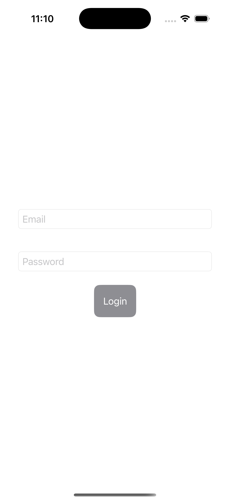
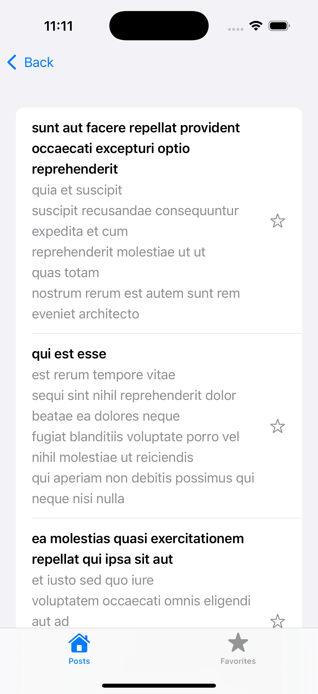
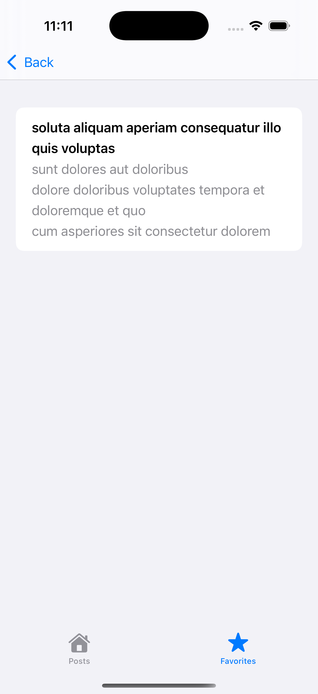

# DynamicApp

## 📌 Overview
DynamicApp is an iOS application built using **SwiftUI**, following the **MVVM** architecture. It uses **Realm-Swift** for local storage, **Alamofire** for networking, and **RxSwift/RxCocoa** for reactive programming.

## 🎯 Features
### **Screen 1: Login Screen**
- Users enter their **email** and **password**.
- Form validation:
  - Email must be a valid email address.
  - Password length: **8-15 characters**.
- **Submit button** is enabled only when the input is valid.
- On login, users are **redirected to Home** (local caching is used).
- Login state is cached using **Realm**, allowing auto-login next time.
- **Logout option** in the Home screen.

### **Screen 2: Home Screen (Tabs - Posts & Favorites)**
#### **Posts Tab**
- Fetches **posts** from `https://jsonplaceholder.typicode.com/posts`.
- Displays **cached posts** when offline.
- Users can **toggle favorite** by tapping the star icon.

#### **Favorites Tab**
- Displays **favorite posts**.
- Users can **remove favorites** via swipe-to-delete.

---
## 🏗 Tech Stack
- **SwiftUI** - UI Development
- **MVVM** - Architecture
- **Realm-Swift** - Local Database
- **Alamofire** - Networking
- **RxSwift / RxCocoa** - Reactive Programming

---
## 🚀 Setup & Installation

### **Step 1: Clone the Repository**
```sh
git clone https://github.com/Umar25iOS/DynamicApp.git
cd DynamicApp

Step 2: Open Project in Xcode
open DynamicApp.xcodeproj

Step 3: Resolve Dependencies
Since this project uses Swift Package Manager (SPM):

Open the project in Xcode.
Go to File > Packages > Reset Package Caches.
Then, go to File > Packages > Resolve Package Versions.
Step 4: Run the App
Select an iOS Simulator.
Press Cmd + R to build and run the project.

---
## 📸 Screenshots

### **Login Screen**


### **Home Screen (Posts)**


### **Favorites Screen**
